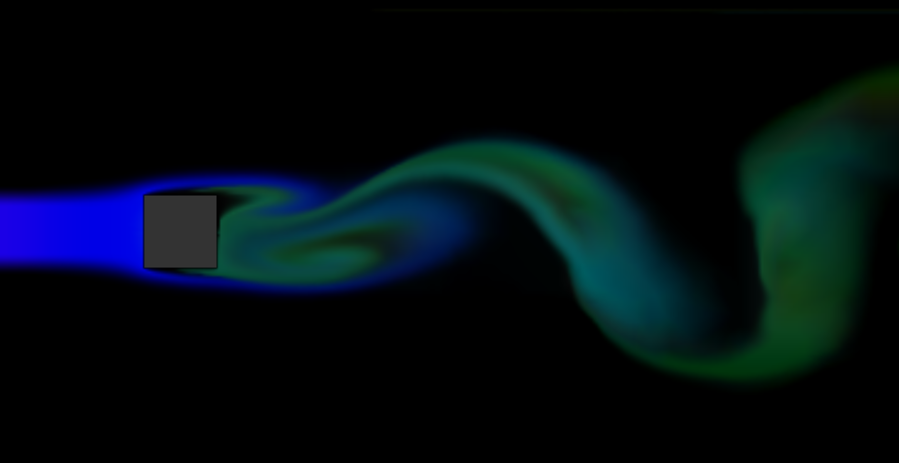

# Fluid Flow around Obstacles

https://yurikasayo.github.io/fluid-flow-around-obstacles/

## Reference
1. [Stable Fluids / Jos Stam](https://d2f99xq7vri1nk.cloudfront.net/legacy_app_files/pdf/ns.pdf)
2. [Real-Time Fluid Dynamics for Games](http://graphics.cs.cmu.edu/nsp/course/15-464/Spring11/papers/StamFluidforGames.pdf)
3. [Fluids-2D / mharrys](https://github.com/mharrys/fluids-2d)
